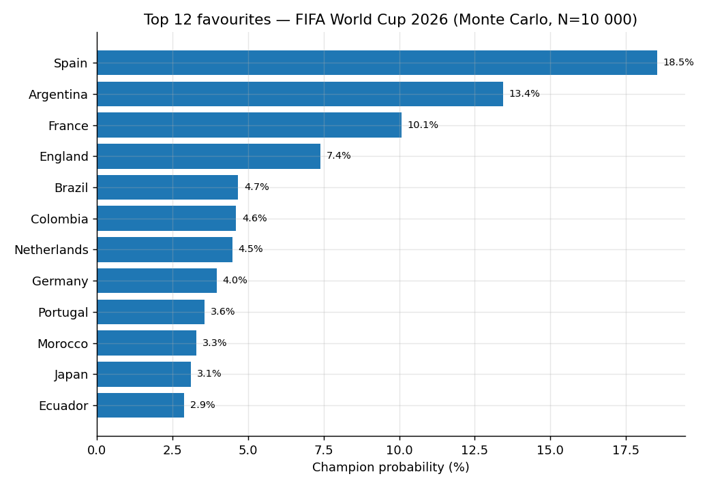
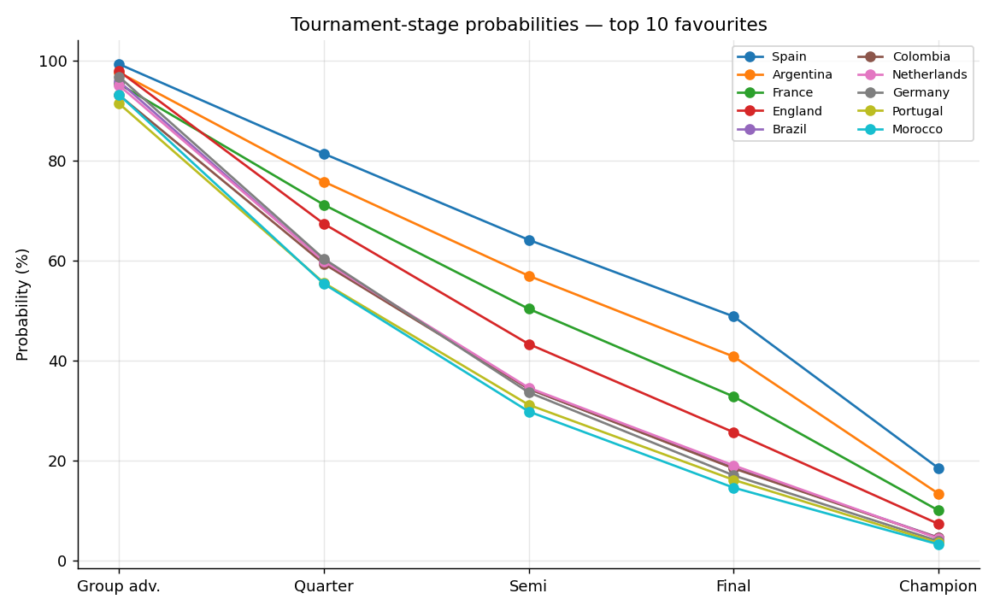
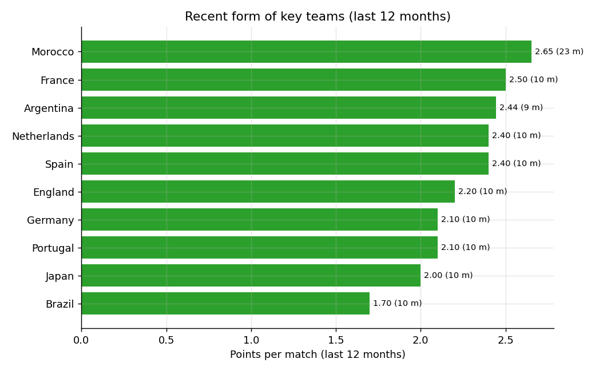
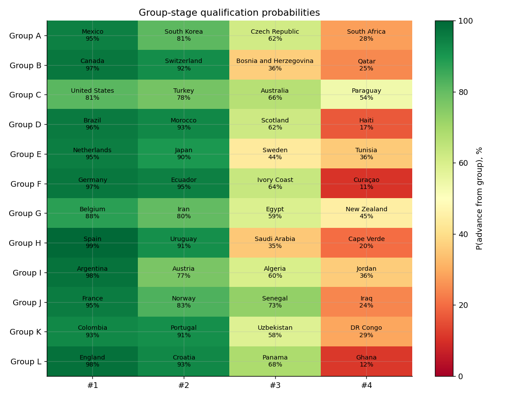

# Mistrzostwa Świata 2026 — analiza i prognoza

## 1. Wstęp i metodologia

Turniej **FIFA World Cup 2026** rozegrany zostanie w **USA, Meksyku i Kanadzie** od **11.06.2026 do 19.07.2026**. Po raz pierwszy w historii w finałach wystąpi **48 reprezentacji** podzielonych na 12 grup po 4 zespoły. Polska nie zakwalifikowała się do turnieju.

### Dane
- Źródło: [Kaggle — *International football results from 1872 to 2017* (martj42)](https://www.kaggle.com/datasets/martj42/international-football-results-from-1872-to-2017/data)
- 49 215 rozegranych meczów reprezentacji (1872 → 2026-03-31)
- 47 601 strzelców goli, 675 serii rzutów karnych, 36 mapowań historycznych nazw
- 72 nierozegranych meczów fazy grupowej WC 2026 jako zbiór do predykcji

### Stack
`pandas`, `numpy`, `scikit-learn`, `matplotlib`, `joblib`, `streamlit`. Python 3.14.

### Cechy modelu (per mecz, stan przed meczem)
- Elo rating każdej drużyny — startowy 1500, K-factor 60 (WC) / 50 (kont.) / 40 (eliminacje) / 20 (sparingi), z modyfikatorem różnicy bramek (FIFA-style).
- Forma — średnie punkty/gole strzelone/stracone z 10 ostatnich meczów.
- Head-to-head — średnie punkty z 5 ostatnich bezpośrednich starć.
- Tier turnieju (one-hot), boisko neutralne, gospodarz, dni od ostatniego meczu.

### Model i walidacja
- Porównanie 3 modeli (Logistic Regression / Gradient Boosting / Random Forest) na podziale czasowym: trening do 2022-12-31, walidacja 2023-01-01 → 2026-03-31.
- Wybrany model: **GradientBoosting** — accuracy **60.52%** vs baseline (zawsze gospodarz) **46.85%**, log-loss **0.865**.
- Symulacja całego turnieju (group + knockout): Monte Carlo, **10 000 powtórzeń**.

## 2. Top faworyci do tytułu

| # | Reprezentacja | P(mistrz) | P(finał) | P(półfinał) | P(ćwierćfinał) | P(awans z grupy) |
|---|---|---:|---:|---:|---:|---:|
| 1 | **Spain** | 18.53% | 48.85% | 64.16% | 81.38% | 99.29% |
| 2 | **Argentina** | 13.43% | 40.83% | 56.97% | 75.79% | 97.62% |
| 3 | **France** | 10.07% | 32.84% | 50.37% | 71.18% | 95.33% |
| 4 | **England** | 7.38% | 25.70% | 43.34% | 67.38% | 97.90% |
| 5 | **Brazil** | 4.66% | 18.61% | 34.38% | 59.84% | 95.85% |
| 6 | **Colombia** | 4.60% | 18.48% | 34.38% | 59.38% | 93.10% |
| 7 | **Netherlands** | 4.47% | 19.08% | 34.60% | 59.89% | 95.04% |
| 8 | **Germany** | 3.95% | 17.08% | 33.67% | 60.38% | 96.78% |
| 9 | **Portugal** | 3.56% | 16.19% | 31.19% | 55.58% | 91.42% |
| 10 | **Morocco** | 3.29% | 14.63% | 29.85% | 55.38% | 93.19% |
| 11 | **Japan** | 3.10% | 14.19% | 28.77% | 52.41% | 89.79% |
| 12 | **Ecuador** | 2.87% | 13.40% | 28.49% | 54.42% | 94.79% |
| 13 | **Croatia** | 2.34% | 11.89% | 25.70% | 51.23% | 92.97% |
| 14 | **Mexico** | 2.20% | 11.28% | 25.34% | 51.69% | 94.87% |
| 15 | **Switzerland** | 1.77% | 9.56% | 23.03% | 48.32% | 92.14% |

## 3. Predykcja podium

- **Złoto** — Spain (P_champion = 18.5%)
- **Srebro** — Argentina (P_champion = 13.4%)
- **Brąz** — France (P_champion = 10.1%)

## 4. Typowani ćwierćfinaliści (P_QF ≥ 25%)

| Reprezentacja | P(ćwierćfinał) | P(półfinał) | Elo |
|---|---:|---:|---:|
| Spain | 81.4% | 64.2% | 2216 |
| Argentina | 75.8% | 57.0% | 2176 |
| France | 71.2% | 50.4% | 2141 |
| England | 67.4% | 43.3% | 2092 |
| Germany | 60.4% | 33.7% | 2037 |
| Netherlands | 59.9% | 34.6% | 2044 |
| Brazil | 59.8% | 34.4% | 2040 |
| Colombia | 59.4% | 34.4% | 2043 |
| Portugal | 55.6% | 31.2% | 2025 |
| Morocco | 55.4% | 29.8% | 2018 |
| Ecuador | 54.4% | 28.5% | 2005 |
| Japan | 52.4% | 28.8% | 2014 |
| Mexico | 51.7% | 25.3% | 1970 |
| Croatia | 51.2% | 25.7% | 1983 |
| Switzerland | 48.3% | 23.0% | 1963 |
| Uruguay | 47.6% | 22.5% | 1963 |
| Belgium | 44.2% | 19.5% | 1945 |
| Norway | 44.1% | 21.0% | 1967 |
| Canada | 44.1% | 17.3% | 1908 |
| Turkey | 41.3% | 19.5% | 1960 |
| United States | 37.5% | 14.6% | 1908 |
| Iran | 35.4% | 13.5% | 1896 |
| Austria | 34.0% | 13.6% | 1905 |
| South Korea | 33.8% | 12.4% | 1888 |
| Senegal | 33.5% | 13.9% | 1912 |
| Australia | 31.1% | 12.5% | 1920 |
| Panama | 25.8% | 8.8% | 1853 |

## 5. Forma kluczowych drużyn (ostatnie 12 miesięcy)

| Drużyna | Mecze | Pkt/mecz | GF/mecz | GA/mecz |
|---|---:|---:|---:|---:|
| Morocco | 23 | 2.65 | 1.87 | 0.26 |
| France | 10 | 2.50 | 2.70 | 1.10 |
| Argentina | 9 | 2.44 | 2.33 | 0.33 |
| Spain | 10 | 2.40 | 3.10 | 0.80 |
| Netherlands | 10 | 2.40 | 3.00 | 0.60 |
| England | 10 | 2.20 | 2.20 | 0.50 |
| Portugal | 10 | 2.10 | 2.60 | 1.00 |
| Germany | 10 | 2.10 | 2.30 | 1.10 |
| Japan | 10 | 2.00 | 1.80 | 0.70 |
| Brazil | 10 | 1.70 | 1.80 | 0.80 |

### Top strzelcy w ostatnich 24 miesiącach

- **Spain** — Mikel Oyarzabal (11), Mikel Merino (9), Fabián Ruiz (4)
- **Argentina** — Lautaro Martínez (9), Lionel Messi (6), Julián Alvarez (4)
- **France** — Kylian Mbappé (8), Randal Kolo Muani (5), Michael Olise (4)
- **England** — Harry Kane (14), Jude Bellingham (3), Declan Rice (3)
- **Brazil** — Raphinha (5), Vinícius Júnior (4), Lucas Paquetá (2)
- **Germany** — Florian Wirtz (7), Jamal Musiala (6), Kai Havertz (4)
- **Netherlands** — Cody Gakpo (10), Memphis Depay (10), Donyell Malen (6)
- **Portugal** — Cristiano Ronaldo (13), Bruno Fernandes (6), Francisco Conceição (3)
- **Morocco** — Ayoub El Kaabi (7), Brahim Díaz (6), Ismael Saibari (4)
- **Japan** — Takumi Minamino (4), Daichi Kamada (4), Koki Ogawa (3)

## 6. Predykcje wszystkich 72 meczów fazy grupowej

| Data | Mecz | P(1) | P(X) | P(2) | Typ |
|---|---|---:|---:|---:|---|
| 2026-06-11 | Mexico – South Africa | 70.4% | 19.6% | 10.0% | **1** |
| 2026-06-11 | South Korea – Czech Republic | 44.0% | 31.2% | 24.8% | **1** |
| 2026-06-12 | Canada – Bosnia and Herzegovina | 72.0% | 17.9% | 10.1% | **1** |
| 2026-06-12 | United States – Paraguay | 47.9% | 28.8% | 23.4% | **1** |
| 2026-06-13 | Qatar – Switzerland | 14.4% | 19.7% | 66.0% | **2** |
| 2026-06-13 | Brazil – Morocco | 36.5% | 32.5% | 31.0% | **1** |
| 2026-06-13 | Haiti – Scotland | 19.9% | 25.1% | 55.0% | **2** |
| 2026-06-13 | Australia – Turkey | 28.2% | 31.4% | 40.4% | **2** |
| 2026-06-14 | Sweden – Tunisia | 40.0% | 27.5% | 32.5% | **1** |
| 2026-06-14 | Netherlands – Japan | 46.2% | 26.7% | 27.1% | **1** |
| 2026-06-14 | Germany – Curaçao | 84.4% | 10.3% | 5.3% | **1** |
| 2026-06-14 | Ivory Coast – Ecuador | 17.6% | 24.3% | 58.2% | **2** |
| 2026-06-15 | Belgium – Egypt | 52.2% | 21.1% | 26.6% | **1** |
| 2026-06-15 | Iran – New Zealand | 47.4% | 30.5% | 22.1% | **1** |
| 2026-06-15 | Spain – Cape Verde | 84.1% | 10.3% | 5.7% | **1** |
| 2026-06-15 | Saudi Arabia – Uruguay | 14.8% | 24.9% | 60.4% | **2** |
| 2026-06-16 | Austria – Jordan | 54.8% | 19.6% | 25.6% | **1** |
| 2026-06-16 | Argentina – Algeria | 65.7% | 24.6% | 9.7% | **1** |
| 2026-06-16 | France – Senegal | 59.1% | 23.8% | 17.1% | **1** |
| 2026-06-16 | Iraq – Norway | 16.8% | 20.3% | 63.0% | **2** |
| 2026-06-17 | Portugal – DR Congo | 66.4% | 21.8% | 11.8% | **1** |
| 2026-06-17 | Uzbekistan – Colombia | 16.1% | 20.9% | 63.0% | **2** |
| 2026-06-17 | England – Croatia | 49.5% | 27.2% | 23.3% | **1** |
| 2026-06-17 | Ghana – Panama | 17.3% | 24.2% | 58.5% | **2** |
| 2026-06-18 | Czech Republic – South Africa | 46.0% | 30.2% | 23.9% | **1** |
| 2026-06-18 | Mexico – South Korea | 55.0% | 27.1% | 17.8% | **1** |
| 2026-06-18 | Switzerland – Bosnia and Herzegovina | 65.7% | 19.7% | 14.6% | **1** |
| 2026-06-18 | Canada – Qatar | 77.9% | 14.2% | 7.8% | **1** |
| 2026-06-19 | Turkey – Paraguay | 43.9% | 26.5% | 29.6% | **1** |
| 2026-06-19 | Scotland – Morocco | 17.5% | 27.4% | 55.0% | **2** |
| 2026-06-19 | Brazil – Haiti | 78.9% | 15.3% | 5.8% | **1** |
| 2026-06-19 | United States – Australia | 45.0% | 29.9% | 25.1% | **1** |
| 2026-06-20 | Netherlands – Sweden | 72.4% | 13.9% | 13.7% | **1** |
| 2026-06-20 | Tunisia – Japan | 14.0% | 24.0% | 62.0% | **2** |
| 2026-06-20 | Germany – Ivory Coast | 61.3% | 24.2% | 14.5% | **1** |
| 2026-06-20 | Ecuador – Curaçao | 78.0% | 15.3% | 6.7% | **1** |
| 2026-06-21 | Belgium – Iran | 45.7% | 19.6% | 34.6% | **1** |
| 2026-06-21 | New Zealand – Egypt | 31.8% | 30.4% | 37.8% | **2** |
| 2026-06-21 | Spain – Saudi Arabia | 86.4% | 9.4% | 4.2% | **1** |
| 2026-06-21 | Uruguay – Cape Verde | 71.5% | 18.6% | 9.9% | **1** |
| 2026-06-22 | France – Iraq | 71.9% | 19.2% | 8.9% | **1** |
| 2026-06-22 | Norway – Senegal | 42.4% | 25.1% | 32.5% | **1** |
| 2026-06-22 | Argentina – Austria | 64.2% | 23.6% | 12.2% | **1** |
| 2026-06-22 | Jordan – Algeria | 27.4% | 28.9% | 43.7% | **2** |
| 2026-06-23 | Portugal – Uzbekistan | 52.5% | 28.1% | 19.4% | **1** |
| 2026-06-23 | Colombia – DR Congo | 64.5% | 23.6% | 11.9% | **1** |
| 2026-06-23 | England – Ghana | 84.1% | 10.3% | 5.5% | **1** |
| 2026-06-23 | Panama – Croatia | 25.6% | 24.8% | 49.5% | **2** |
| 2026-06-24 | Morocco – Haiti | 74.5% | 17.0% | 8.5% | **1** |
| 2026-06-24 | Bosnia and Herzegovina – Qatar | 43.8% | 26.6% | 29.6% | **1** |
| 2026-06-24 | Scotland – Brazil | 15.2% | 24.7% | 60.1% | **2** |
| 2026-06-24 | South Africa – South Korea | 17.9% | 23.2% | 58.9% | **2** |
| 2026-06-24 | Mexico – Czech Republic | 56.3% | 26.2% | 17.5% | **1** |
| 2026-06-24 | Canada – Switzerland | 45.9% | 27.6% | 26.5% | **1** |
| 2026-06-25 | United States – Turkey | 41.3% | 27.9% | 30.9% | **1** |
| 2026-06-25 | Paraguay – Australia | 30.8% | 31.5% | 37.7% | **2** |
| 2026-06-25 | Curaçao – Ivory Coast | 17.1% | 23.5% | 59.4% | **2** |
| 2026-06-25 | Ecuador – Germany | 30.2% | 31.7% | 38.1% | **2** |
| 2026-06-25 | Japan – Sweden | 60.9% | 24.1% | 15.0% | **1** |
| 2026-06-25 | Tunisia – Netherlands | 13.9% | 20.5% | 65.6% | **2** |
| 2026-06-26 | Senegal – Iraq | 54.3% | 28.2% | 17.5% | **1** |
| 2026-06-26 | Norway – France | 24.1% | 17.7% | 58.2% | **2** |
| 2026-06-26 | Uruguay – Spain | 13.2% | 23.9% | 62.8% | **2** |
| 2026-06-26 | New Zealand – Belgium | 20.5% | 22.2% | 57.4% | **2** |
| 2026-06-26 | Egypt – Iran | 26.3% | 29.2% | 44.5% | **2** |
| 2026-06-26 | Cape Verde – Saudi Arabia | 29.8% | 28.0% | 42.2% | **2** |
| 2026-06-27 | Panama – England | 14.5% | 21.3% | 64.1% | **2** |
| 2026-06-27 | Algeria – Austria | 28.8% | 27.6% | 43.6% | **2** |
| 2026-06-27 | Jordan – Argentina | 8.4% | 15.5% | 76.2% | **2** |
| 2026-06-27 | Colombia – Portugal | 37.2% | 27.6% | 35.2% | **1** |
| 2026-06-27 | DR Congo – Uzbekistan | 25.6% | 29.6% | 44.8% | **2** |
| 2026-06-27 | Croatia – Ghana | 81.1% | 10.1% | 8.8% | **1** |

## 7. Analiza grup

**Grupa A**
- Mexico — P(awans) = 94.9% (Elo 1970)
- South Korea — P(awans) = 80.9% (Elo 1888)
- Czech Republic — P(awans) = 61.5% (Elo 1793)
- South Africa — P(awans) = 28.0% (Elo 1678)

**Grupa B**
- Canada — P(awans) = 96.7% (Elo 1908)
- Switzerland — P(awans) = 92.1% (Elo 1963)
- Bosnia and Herzegovina — P(awans) = 36.5% (Elo 1659)
- Qatar — P(awans) = 24.5% (Elo 1625)

**Grupa C**
- United States — P(awans) = 81.3% (Elo 1908)
- Turkey — P(awans) = 77.6% (Elo 1960)
- Australia — P(awans) = 66.4% (Elo 1920)
- Paraguay — P(awans) = 53.8% (Elo 1896)

**Grupa D**
- Brazil — P(awans) = 95.9% (Elo 2040)
- Morocco — P(awans) = 93.2% (Elo 2018)
- Scotland — P(awans) = 62.1% (Elo 1838)
- Haiti — P(awans) = 17.0% (Elo 1662)

**Grupa E**
- Netherlands — P(awans) = 95.0% (Elo 2044)
- Japan — P(awans) = 89.8% (Elo 2014)
- Sweden — P(awans) = 43.6% (Elo 1788)
- Tunisia — P(awans) = 35.9% (Elo 1742)

**Grupa F**
- Germany — P(awans) = 96.8% (Elo 2037)
- Ecuador — P(awans) = 94.8% (Elo 2005)
- Ivory Coast — P(awans) = 63.6% (Elo 1804)
- Curaçao — P(awans) = 10.9% (Elo 1604)

**Grupa G**
- Belgium — P(awans) = 87.8% (Elo 1945)
- Iran — P(awans) = 80.1% (Elo 1896)
- Egypt — P(awans) = 59.2% (Elo 1800)
- New Zealand — P(awans) = 44.8% (Elo 1767)

**Grupa H**
- Spain — P(awans) = 99.3% (Elo 2216)
- Uruguay — P(awans) = 91.4% (Elo 1963)
- Saudi Arabia — P(awans) = 35.4% (Elo 1707)
- Cape Verde — P(awans) = 20.2% (Elo 1646)

**Grupa I**
- Argentina — P(awans) = 97.6% (Elo 2176)
- Austria — P(awans) = 76.8% (Elo 1905)
- Algeria — P(awans) = 59.8% (Elo 1855)
- Jordan — P(awans) = 36.2% (Elo 1790)

**Grupa J**
- France — P(awans) = 95.3% (Elo 2141)
- Norway — P(awans) = 83.2% (Elo 1967)
- Senegal — P(awans) = 72.9% (Elo 1912)
- Iraq — P(awans) = 24.2% (Elo 1749)

**Grupa K**
- Colombia — P(awans) = 93.1% (Elo 2043)
- Portugal — P(awans) = 91.4% (Elo 2025)
- Uzbekistan — P(awans) = 58.2% (Elo 1860)
- DR Congo — P(awans) = 29.1% (Elo 1757)

**Grupa L**
- England — P(awans) = 97.9% (Elo 2092)
- Croatia — P(awans) = 93.0% (Elo 1983)
- Panama — P(awans) = 68.5% (Elo 1853)
- Ghana — P(awans) = 11.6% (Elo 1620)

## 8. Ograniczenia modelu

- Brak składów osobowych — model nie wie o kontuzjach. Predykcja bazuje wyłącznie na formie zespołowej i historii.
- Brak xG, posiadania, statystyk klubowych — dataset zawiera tylko wyniki meczów.
- Drabinka pucharowa losowana — oficjalnego mapowania bracket-grup nie znamy, więc w każdej iteracji Monte Carlo pary R32 są losowane. Topowe drużyny czasem spotykają się wcześniej niż w realnym losowaniu.
- Tiebreaker grupowy = Elo — różnicy bramek nie symulujemy explicite.